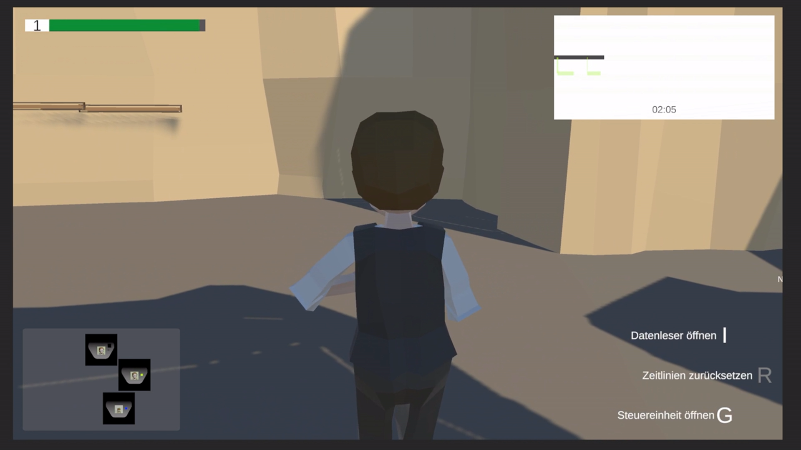

# A Fraction of Time: Konzeption und Entwicklung eines Singleplayer Adventure Games zum Thema multidimensionale Realitäten

“A Fraction of Time (Arbeitstitel)” basiert auf der Idee, den Spieler verschiedene parallele Zeitlinien von sich selbst erzeugen zu lassen. Der Spieler muss in diesen verschiedenen Zeitlinien, mithilfe diverser Zeitlinien von sich selbst, Rätsel lösen und mit seinen Zeitlinien zusammenarbeiten. Grundlage dieser Weiterentwicklung ist der digitale Prototyp, der bereits im Gamedesign Workshop im Wintersemester 2021/2022 entwickelt wurde.

Die Zielsetzung dieser Abschlussarbeit ist es, das bisher implementierte System auf technischer Seite so weit zu verbessern, dass es für den Spieler offensichtlich fehlerfrei funktioniert. Außerdem soll ein Rahmen geschaffen werden, in dem es möglich ist, Erweiterungen zu integrieren. Hinzu werden weitere Inhalte, wie weitere Levels und Spielwelten konzipiert und umgesetzt. Der Spieler soll dabei eine Variation an Spielwelten und Rätsel erhalten, welche er lösen muss, um das jeweilige Level abzu- schließen. Hierbei soll ihm auch das Spielprinzip so vermittelt werden, dass er durch das Verständnis der Mechanik jedes Rätsel lösen kann. Validiert werden die Inhalte durch User-Tests, bei denen das Verständnis der Spielmechanik auf inhaltlicher und technischer Ebene abgefragt wird.

## Zugang zur Arbeit

📄 [Bachelorarbeit lesen](./bachelorarbeit.pdf)

## Zugang zur Präsentation

📄 [Präsentation ansehen](./präsentation.pdf)

## Hintergründe

Das grundlegende Konzept dieser Bachelor-Thesis wurde im Rahmen des Gamedesign-Workshops an der Hochschule Furtwangen University (HFU) im Wintersemester 2021/2022 entworfen. Durch das gute Feedback am Tag der Medien 2021 und das Interesse an einer echten spielfähigen Version wurde beschlossen, das Konzept weiterzuentwickeln. Inhalte aus dem im Anhang beiliegenden Gamedesign-Dokument wurden übernommen, einige wurden verbessert und andere verworfen. Der Titel des Projektes heißt “A Fraction of Time”.

## Forschungskontext

### Forschungsstand zu Adventure-Games

Adventure-Games zeichnen sich durch narratives Rätsellösen mit wenig bis keinen Action-Elementen aus (Bronstring, 2012). Viele Titel nutzen kooperative Ansätze: „A Way Out“ und „It Takes Two“ von EA setzen auf Multiplayer-Koop, während Spiele wie „The Last of Us“ oder die „Uncharted“-Reihe kooperative Effekte über NPCs einbinden. Zeit als narratives Element wird in Titeln wie „Quantum Break“ oder „Bioshock Infinite“ linear eingesetzt, während „Life is Strange“ Zeitmanipulation direkt in das Gameplay integriert und damit zukünftige Ereignisse beeinflusst.

### Forschungsstand Replay-Systeme in Videospielen

Replay-Systeme finden sich vor allem in Ego-Shootern und Rennspielen. Sie basieren meist auf gespeicherten Spieler-Inputs, die in einer deterministischen Engine erneut abgespielt werden. Beispiele sind Kill-Cams in „Call of Duty: Black Ops 2“ oder Wiederholungen von Fahrten in „Forza Horizon 4“. Auch im Puzzle-Spiel „The Talos Principle“ können Bewegungen aufgenommen und wiedergegeben werden, die die Spielwelt beeinflussen. Im Gegensatz dazu erlaubt die hier untersuchte Arbeit eine verschachtelte Nutzung solcher Aufnahmen.

## Forschungsfragen

- Wie kann das Spielkonzept von “A Fraction of Time” als leicht verständliches Tutorial dargestellt werden ?
- Wie komplex können Rätsel aufgebaut werden, sodass der Spieler maximal herausgefordert wird ?

## Konzeption anhand des MDA-Frameworks

- Mechanics (Spielmechaniken & Systeme)
    - Grundkonzept: Rätselspiel mit Fokus auf Zeitmanipulation und parallelen Zeitlinien.
    - Zeitkontinuum: Überwachendes System, das Stabilität misst und Paradoxen erkennt.
    - Splitting: Erzeugen neuer Zeitlinien mit alternativen „Ichs“ des Chronologen, die unabhängig Aktionen ausführen können.
    - Merging: Zurückspringen zu Knotenpunkten, um frühere Zeitlinien wieder zu aktivieren und ihre gespeicherten Aktionen ablaufen zu lassen.
    - Paradoxen: Entstehen, wenn Zustände in aufgenommenen Zeitlinien verändert werden → führt zu Instabilität oder Konvergenz.
    - Graph: Visualisiert die erzeugten Zeitlinien und deren Abhängigkeiten.
    - Labor: Zentrale Hub-Welt zum Speichern, Planen und Auswählen von Leveln.
    - Level-Struktur: Rätsel basieren auf logischer Abfolge von Splitting/Merging und Interaktionen (Druckplatten, Hebel, Plattformen).
    - Stabilitätssystem: Timer + Stabilitätsanzeige → zu viele Paradoxen oder instabile Splits führen zum Levelverlust.
    - Belohnungen: Neue Ichs oder Gegenstände, die alternative Lösungswege eröffnen.

- Dynamics (Spielabläufe & Interaktionen)
    - [Spielablauf](./content/pictures/main_loop.jpg):
        - Startmenü → Tutorial (mit oder ohne geführte Erklärungen).
        - Kapiteleinteilung (je 5 Level).
        - Ab Kapitel 2 Zugang zum Labor → Wiederspielen alter Level mit neuen Ichs/Items möglich.
        - Fortschritt durch Story-Sequenzen zwischen den Leveln.

    - [Level-Ablauf](./content/pictures/level_loop.jpg):
        - Spieler startet als Chronologe in einer Spielwelt.
        - Bei Hindernissen erzeugt er alternative Zeitlinien (Splitting).
        - Alternative Ichs lösen Aufgaben, während der Haupt-Charakter profitiert.
        - Durch Merging kann er zurückspringen, frühere Aktionen auslösen und mehrere Ichs koordinieren.
        - Instabilität → Weltveränderungen (verschobene Wände, Gegenstände).

    - [Labor-Ablauf](./content/pictures/labor_loop.jpg):
        - Hub für Levelauswahl, Informationssammlung und Storyfortschritt.
        - Computer als Wissensdatenbank über gesammelte Objekte und Hinweise.
        - Portal zum Starten neuer Level.

    - Risiko & Spannung:
        - Zu viele Paradoxen oder Instabilitäten → Zeitlinienkonvergenz, Level scheitert.
        - Spieler muss seine Splits taktisch planen und die Stabilität managen.

- Aesthetics (Spielerfahrung & Emotionen)
    - Atmosphäre: Steampunk-Setting mit viktorianischer Ästhetik (Kupfer, Messing, Zahnräder, Dampf).

    - Emotionale Kern-Erfahrungen:
        - Meisterschaft: Spieler empfindet Befriedigung beim cleveren Koordinieren mehrerer Zeitlinien.
        - Entdeckung: Spieler erforscht alternative Zeitlinien und entdeckt ihre Geschichten über Umgebung & Objekte.
        - Spannung: Instabilität und drohende Paradoxen schaffen Nervenkitzel.
        - Immersion: Steampunk-Welt mit alternativen Zeitsträngen, dystopischen Einflüssen und Story um das zukünftige Ich.

    - Story-getriebene Motivation: Jagd nach dem zukünftigen Ich, Reparatur des Kontinuums und Rückkehr in die ursprüngliche Zeitlinie.

## Umsetzung

### Erstellte Spielwelten

<table>
  <tr>
    <td>
      
    </td>
    <td>
        
    </td>
  </tr>
</table>

### Showcase Spielmechanik

<!-- 
 -->
 

### Informationen zur Spielmechanik

Möchtest du mehr über die Zeitreise-Mechanik lesen? In den Seiten 92 - 148 wird die Spielmechanik detailreich vorgestellt.

## Prototyp

Wurde dein Interesse geweckt?

Lad dir einfach die aktuellste Version des Prototyps [herunter](https://github.com/athaeck/a-fraction-of-time-demo-releases) und versuch dein Glück!

Melde dich einfach über dieses [Kontaktformular](https://athaeck.github.io/) bei mir, um den Quellcode für den Prototyp und eine Anleitung zu erhalten!

## Quellen

Bronstring, Marek (2012):What are adventure games?

